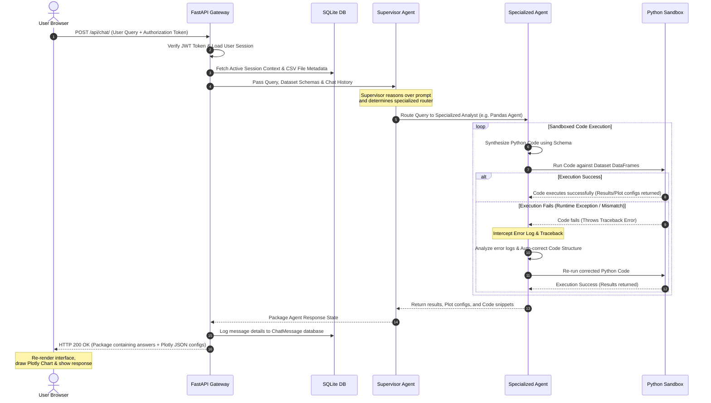

# InsightAI — Agentic Data Analyst

**InsightAI** is a state-of-the-art, full-stack agentic data analysis application that turns raw CSV datasets into interactive business intelligence. Powered by an advanced multi-agent system, users can upload multiple datasets, check data quality diagnostics, execute predictive statistical forecasts, and query their data using natural language.

---

## 📖 Executive Project Overview

Data is the lifeblood of modern enterprise decision-making, yet extracting immediate value from raw datasets typically requires specialised skills in Python, SQL, and business intelligence (BI) tools. **InsightAI** bridges this gap by offering a fully autonomous, conversational data analyst workspace. 

InsightAI doesn't just execute predefined queries; it actively reasons over your dataset's schema. By distributing analytical workloads across a specialised network of cooperative AI agents, the platform is capable of answering complex quantitative questions, plotting multi-variable graphs, detecting mathematical anomalies, and auditing dataset health. It is designed to act as an on-demand junior data scientist for business analysts and product teams.

---

## 🔍 Complete Project Description

InsightAI is structured to address the core challenges of natural language interfaces for data analytics: code generation errors and brittle database integrations. The system solves these problems through three core paradigms:

1.  **Multi-Agent Collaborative Design (Orchestration via LangGraph):** Rather than relying on a single general-purpose LLM, InsightAI employs a supervisor agent that coordinates specialized subordinates (SQL Agent, Pandas Code Agent, Graph Agent, Anomaly Detector, and Summary Analyst). Each agent is prompted with strict boundary constraints and specialized tools.
2.  **Autonomous Self-Healing Execution Sandbox:** A common failure mode of LLM-generated code is syntax errors or runtime exceptions (e.g. mismatched DataFrame join indexes). InsightAI runs code inside an isolated execution sandbox. If a traceback occurs, the system intercepts the error logs and feeds them back to the generating agent. The agent analyzes the crash log, self-corrects the code, and re-executes the block.
3.  **Unified Structural Integrity & Forecasting Telemetry:** To provide visual feedback, the system offers an automated Data Quality Suite (profiling completeness and outliers) and a statistical Forecasting Engine (projecting values over adjustable horizons with 95% confidence intervals).

---

## 📐 Project Architecture

InsightAI is built upon a modular, decoupled full-stack architecture designed for low-latency operations and high reliability:

```
  ┌────────────────────────────────────────────────────────┐
  │                   User Browser (React)                 │
  └───────────┬────────────────────────────────┬───────────┘
              │ (HTTP REST / JSON)             │ (Auth Bearer Token)
  ┌───────────▼────────────────────────────────▼───────────┐
  │                FastAPI Gateway API                     │
  └───────────┬────────────────────────────────┬───────────┘
              │ (SQLAlchemy ORM)               │ (LangGraph / LangChain)
  ┌───────────▼───────────┐        ┌───────────▼───────────┐
  │    SQLite Database    │        │   Supervisor Agent    │
  │ (Credentials & Logs)  │        └───────────┬───────────┘
  └───────────────────────┘                    │ (Router Execution)
                           ┌───────────────────┴───────────────────┐
                           ▼                                       ▼
                 ┌───────────────────┐                   ┌───────────────────┐
                 │  Pandas SQL Agent │                   │ Plotly Graph Agent│
                 └─────────┬─────────┘                   └─────────┬─────────┘
                           │ (Code Execution / Validation)         │
                           └───────────────────┬───────────────────┘
                                               ▼
                                   ┌───────────────────────┐
                                   │ Python Sandbox Exec   │
                                   │ (With Self-Healing)   │
                                   └───────────────────────┘
```

### 1. Presentation Layer (Frontend Client)
A responsive React dashboard built with TypeScript. The UI is designed with glassmorphic cards and dynamic transitions:
*   **Chat Workspace:** Rich message interface that handles user queries and renders code blocks, SQL commands, dataset tables, and Plotly graphics.
*   **Operations Telemetry Dashboard:** Generates line and donut chart plots monitoring agent distribution usages and volume timelines.
*   **Data Quality Hub:** Audits dataset integrity using radial gauge rings, column completeness meters, and statistical outlier blocks.
*   **Forecasting Suite:** Parameter selector (Horizon, Algorithm) showing projection curves alongside confidence interval bands.

### 2. Application Gateway Layer (Backend API)
FastAPI services handling authentication, file processing, and session state persistence:
*   **Authentication & Security:** JWT Token sign-in with password hashing via passlib (bcrypt).
*   **API Routers:** Decoupled endpoints handling dashboard stats, file uploading, dataset quality audits, and forecasting.

### 3. Agent Execution Layer (Multi-Agent Workspace)
Orchestrated through LangGraph, the agent system manages:
*   **Stateful Memory:** Persists chat context across sessions using SQLite checkpointing.
*   **Agent Cooperation:** The **Supervisor Agent** routes prompts to target analysts based on user intent.
*   **Self-Healing Sandboxed Execution:** Compiles and tests code, looping traceback details to the generating agent if runtime failures occur.

---

## 🔄 Working Workflow Sequence

The following diagram illustrates the life-cycle of a user prompt inside the InsightAI system, including token authentication, supervisor routing, sandboxed execution, and the self-healing error loop:



---

## 🚀 Key Features

*   **Agentic AI Chat Analyst:** Collaborative multi-agent workflow (Supervisor, SQL, Pandas, Graph, Anomaly, and Insights agents) equipped with **self-healing compilation loops** to automatically catch and correct code execution tracebacks.
*   **Operations Telemetry Dashboard:** Real-time system monitoring panel detailing uploaded datasets, conversation summaries, query volumes, average query lengths, agent usage share distributions (pie chart), and chronological query frequencies (line plot).
*   **Automated Data Quality Audits:** In-depth data profiling tab calculating duplicate rows, missing cell percentages, data type validation badges, and numeric column outliers (via Interquartile Range thresholds). Includes actionable AI-driven data cleaning suggestions.
*   **Predictive Time-Series Forecasting:** Custom period projections (7 to 90 days) supporting Linear Trend projection, Simple Exponential Smoothing (SES), and windowed Moving Averages. Automatically renders forecasted lines alongside **95% Confidence Interval shaded bands**.
*   **Persistent Multi-Dataset Support:** User accounts with secure authentication (JWT) and multi-dataset check-selection that restores states upon reload.

---

## 🛠️ Tech Stack

*   **Frontend:** React 18, Vite, TypeScript, TailwindCSS, Plotly.js, Axios, Lucide Icons.
*   **Backend:** FastAPI, Python 3.12, Uvicorn, SQLite, SQLAlchemy ORM.
*   **Data Analysis & Modeling:** Pandas, NumPy, DuckDB, Scikit-Learn, Plotly.
*   **AI Agent Orchestration:** OpenAI API, LangGraph, LangChain.

---

## 📂 Folder Structure

```
raja_DBO/
├── backend/
│   ├── agents/             # LangGraph agent definitions (Supervisor, SQL, Pandas, etc.)
│   ├── api/                # FastAPI routing controllers (auth, chat, forecast, quality, dashboard)
│   ├── db/                 # SQLite database config and SQLAlchemy schemas
│   ├── graphs/             # Workflow graphs for multi-agent execution
│   ├── uploads/            # Scoped user CSV directory structure
│   ├── main.py             # Main entry point (FastAPI server mount)
│   └── requirements.txt    # Python package dependencies
├── frontend/
│   ├── src/
│   │   ├── components/     # Reusable React components (ChatWindow, ChartViewer, etc.)
│   │   ├── context/        # React Auth Context state management
│   │   ├── pages/          # Layout pages (AuthPage, App tabs)
│   │   ├── App.tsx         # Main router layout & tabs render
│   │   └── main.tsx        # React client entry point
│   ├── package.json        # Frontend NPM script definitions
│   └── vite.config.ts      # Vite configuration
└── README.md               # Project documentation
```

---

## ⚙️ Installation & Setup

### Prerequisites
*   Python 3.10+
*   Node.js 18+ & NPM

### Environment Configuration
Create a `.env` file in the `backend/` directory:
```env
# backend/.env
OPENROUTER_API_KEY=your_openrouter_or_openai_api_key
```

---

## 🖥️ Running the Project

### 1. Start the Backend API
Navigate to the `backend/` directory, create a virtual environment, install dependencies, and launch:
```bash
cd backend
python -m venv venv
# Windows
venv\Scripts\activate
# Unix/macOS
source venv/bin/activate

pip install -r requirements.txt
uvicorn main:app --reload
```
The server will start at `http://localhost:8000`.

### 2. Start the Frontend client
Navigate to the `frontend/` directory, install NPM dependencies, and start:
```bash
cd frontend
npm install
npm run dev
```
The client will start at `http://localhost:5173`.

---

## 📊 Sample Dataset Drive Links

https://drive.google.com/drive/folders/1KUEW6C8oeEcsxKsEW4ZUtrXlFCrF6hPU?usp=sharing
---

## 📷 Screenshots Drive Link

https://drive.google.com/drive/folders/1wOKz7cAhz4Hi0I684S2ZAqkYKVdfE5Ja?usp=sharing

---

## 🎥 Demo Video Drive

https://drive.google.com/drive/folders/1wwJoFq0EZ6xwjAJFVDNnzBCgNQnrd-Nm?usp=sharing


---

## 🔌 API Endpoints Overview

| Method | Endpoint | Description |
| :--- | :--- | :--- |
| **POST** | `/api/auth/register` | Register a new user account |
| **POST** | `/api/auth/login` | Login and obtain JWT authorization token |
| **POST** | `/api/upload/csv` | Upload raw CSV dataset to user workspace |
| **GET** | `/api/upload/list` | List all uploaded CSV files for current user |
| **POST** | `/api/chat/` | Query selected datasets via agentic workflows |
| **GET** | `/api/dashboard/stats/` | Fetch platform operations telemetry stats & timeline plots |
| **GET** | `/api/quality/{filename}`| Profile dataset completeness, nulls, duplicates, and outliers |
| **POST** | `/api/forecast/` | Run statistical forecasts (Linear, SES, Moving Average) |

---

## 🔮 Future Enhancements
*   **Multi-File Joins Forecasting:** Cross-dataset time-series correlations.
*   **Vector Semantic Search:** Embeddings-based query classification.
*   **Streaming Responses:** Real-time token streaming for LLM answers.
*   **Offline Evaluation Benchmark:** Automated accuracy and latency tracing metrics.

---

## 📄 License
This project is licensed under the MIT License - see the LICENSE file for details.

---

## ✍️ Author
Designed & Developed by **C. Maha Raja**.
